# STAAR Performance Phase I - MOY Model (Grade Levels 3-8 Math)

## Overview

Phase I provides an end-to-end evaluation to identify the best Middle-Of-Year (MOY) STAAR performance modeling direction for Grade 3-8 Math.

The document begins with exploratory data analysis (EDA) to assess target behavior, class balance, feature distributions, and feature-to-target signal. It then evaluates multiple model families using a shared prepared feature set and two targets: regression for `Results__Raw__Score` and classification for `Results__Performance_Level`.

Model results are compared across Linear Models, Decision Trees, Random Forest, XGBoost, and Support Vector Machine (SVM), including metric review and diagnostic plots.

---

## Exploratory Data Analysis (EDA)

### Raw Score Distribution

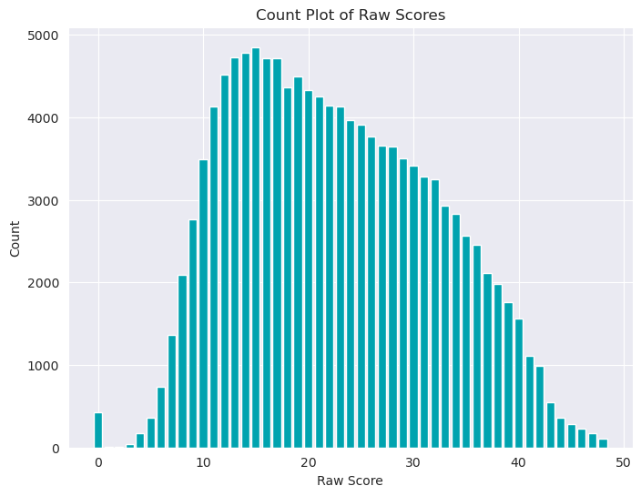

The raw-score distribution is unimodal and concentrated in the mid-range, with the highest frequencies around the low-to-mid teens. The distribution slopes gradually downward as scores increase, showing a long right tail that extends into the upper 40s. This indicates that most students cluster in the middle of the score range, while high raw scores are progressively less common.

#### What this suggests

- The target is not uniformly distributed, so regression models will need to account for score concentration around the center of the range.
- The long tail suggests that extreme high scores are comparatively rare and may be harder to predict accurately.

### Performance Level Distribution

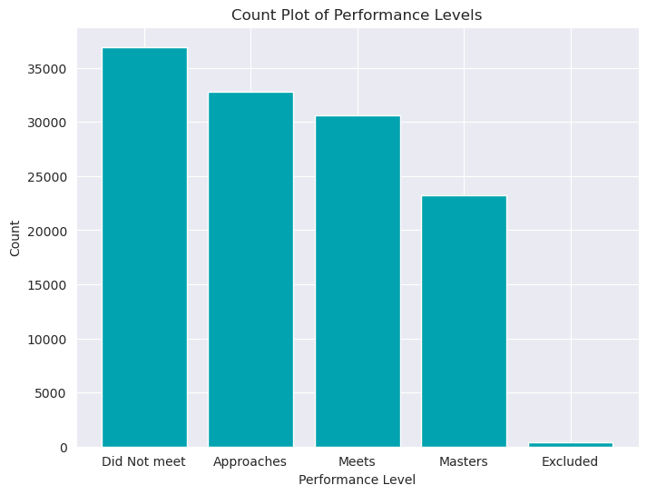

The performance-level plot shows a clear class imbalance. `Did Not Meet` is the largest group, followed by `Approaches` and `Meets`, with `Masters` as the smallest meaningful performance band. `Excluded` is present only at a very small volume relative to the other classes.

#### What this suggests

- Classification models will need to handle imbalance across performance bands.
- Overall class structure is realistic for STAAR outcomes, but minority-class performance will need to be checked carefully.

### Feature Distribution Review

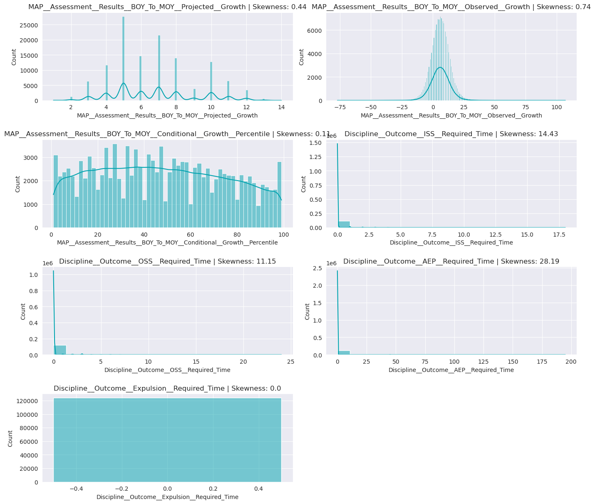

The feature distribution view shows that the MAP assessment predictors are not shaped the same way. `MAP__Assessment__Results__BOY_To_MOY__Projected__Growth` appears discrete and stepped, which is consistent with a bounded growth measure. `MAP__Assessment__Results__BOY_To_MOY__Observed__Growth` is concentrated around a central band with mild skew. `MAP__Assessment__Results__BOY_To_MOY__Conditional__Growth__Percentile` is comparatively broad across the range, while the discipline timing features are heavily zero-inflated and strongly right-skewed, indicating that most students have no recorded disciplinary duration and a small subset carries large values.

#### What this suggests

- Some predictors are naturally sparse or zero-inflated, especially discipline-based features.
- The mix of bounded, skewed, and discrete features supports the use of feature engineering and multiple model families rather than relying on a single modeling assumption.

### Feature Correlation Review

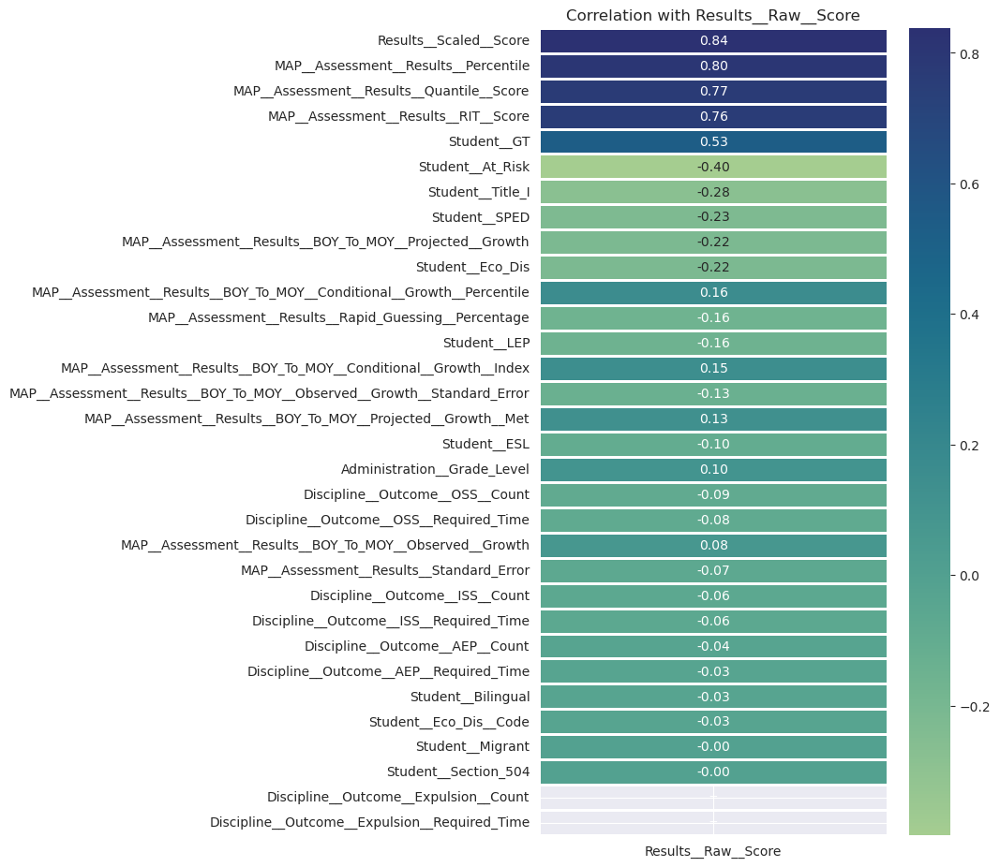

The correlation plot shows the strongest positive relationships between raw score and the MAP/assessment achievement measures. `Results__Scaled__Score`, `MAP__Assessment__Results__Percentile`, `MAP__Assessment__Results__Quantile__Score`, and `MAP__Assessment__Results__RIT__Score` are the strongest positive signals. Student program indicators such as `Student__GT` also show a meaningful positive relationship, while risk-related indicators such as `Student__At_Risk`, `Student__SPED`, `Student__Eco_Dis`, and `Student__Title_I` are negatively correlated with raw score. Discipline outcome counts and required time features show relatively weak relationships compared with the core assessment predictors.

#### What this suggests

- Assessment-derived metrics are the strongest single predictors and should remain central to model development.
- Student-program features add useful signal, especially for separating higher- and lower-performing groups.
- Discipline features appear weaker individually, but they may still contribute incremental value in tree-based or ensemble models.

### Summary

Taken together, the plots show a modeling problem with strong core assessment signal, class imbalance in the performance target, and a mix of dense, discrete, and sparse predictors.

This supports the next phase of work: compare regression and classification model families, evaluate the value of student-program and discipline features, and select the model approach that balances predictive quality with interpretability.

---

## Model Framing

The Decision Tree, Random Forest, XGBoost, and SVM experiments all start from the same prepared predictor set (assessment, MAP growth, student-program, and discipline features) so results are directly comparable across model families.

For each model family, Phase I runs two prediction tasks from that shared feature space:

- Regressor track: predicts continuous raw score (`Results__Raw__Score`).
- Classifier track: predicts categorical performance level (`Results__Performance_Level`).

This design isolates the impact of algorithm choice while holding input features constant, making it easier to compare performance, generalization, and interpretability.

---

## Linear Models

Phase I compares three candidate linear models for predicting STAAR Grade 3-8 Math MOY raw scores.

Each model adds predictive signal to the same baseline feature set, allowing the evaluation to measure whether student-program context improves score prediction beyond MAP assessment indicators alone.

### Model Comparison

| Model | R2 | Mean Squared Error | Root Mean Squared Error |
|------|----------------|--------------------|--------------------------|
| Model 1 | 0.6794 | 28.7907 | 5.3657 |
| Model 2 | 0.6904 | 27.7997 | 5.2725 |
| Model 3 | 0.6907 | 27.7786 | 5.2705 |

### Regression Interpretation

Model 1 establishes the baseline regression signal using the core MAP assessment predictors. Model 2 improves on the baseline by adding `Student__GT`, which produces a noticeable gain in fit and a reduction in error. Model 3 adds `Student__At_Risk` and produces only a marginal improvement over Model 2.

#### What this suggests

- The baseline MAP predictors already explain a substantial portion of raw-score variation.
- Student-program context adds predictive value, but the incremental gain levels off after Model 2.
- Model 3 performs best overall, but the improvement over Model 2 is small, which suggests diminishing returns from adding the final feature.

### Summary

The results indicate that Phase I can produce a reasonably strong baseline model for STAAR Math MOY raw-score prediction.

The small performance gap between Model 2 and Model 3 suggests that the final model selection should consider not only error reduction but also interpretability and feature simplicity.

---

## Decision Trees

Phase I also evaluated decision-tree approaches for both regression and classification tasks using the same prepared feature set and a validation-based depth search.

### Regressor Model

Best Depth: 9  
Best Validation Error: 0.2629

#### Training vs Validation Error

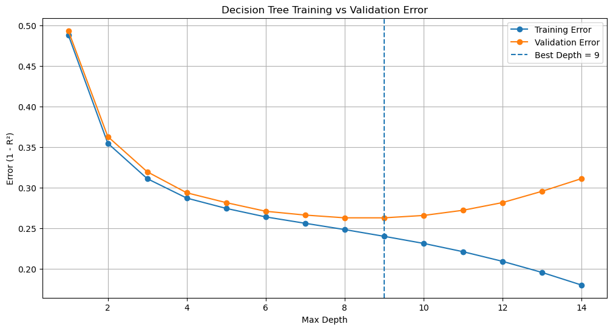

The regressor curve shows a clear bias-variance tradeoff. Validation error drops sharply from shallow depths and reaches its minimum at depth 9. Beyond that point, training error continues to decrease while validation error begins to rise, indicating overfitting.

#### Regressor Feature Importance

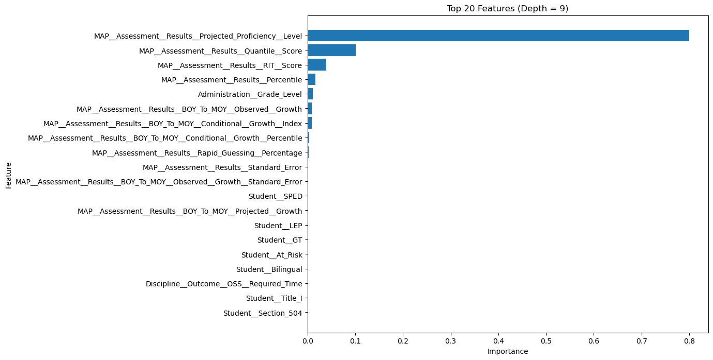

Feature-importance rankings are highly concentrated, with projected proficiency level dominating and MAP quantile/RIT/percentile forming the next tier. Student and discipline features contribute comparatively smaller marginal influence in this regressor.

### Classifier Models

#### Entropy Classifier

Best Depth: 8  
Best Validation Error: 0.3676

##### Training vs Validation Error

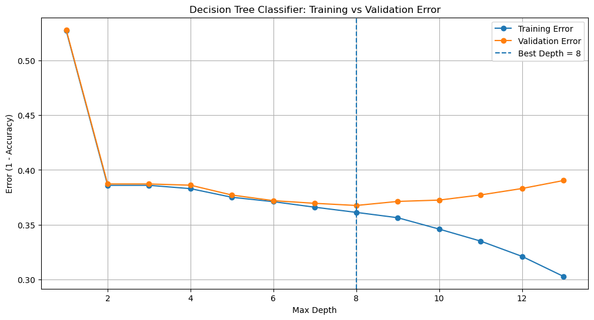

The entropy classifier reaches its lowest validation error at depth 8, then begins to diverge from the training curve, indicating overfitting beyond that depth.

##### Feature Importance

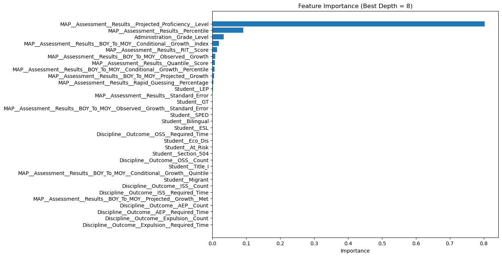

Feature importance is concentrated in projected proficiency and percentile, with grade level and selected MAP growth indicators acting as secondary class separators.

#### Gini Classifier

Best Depth: 7  
Best Validation Error: 0.3712

##### Training vs Validation Error

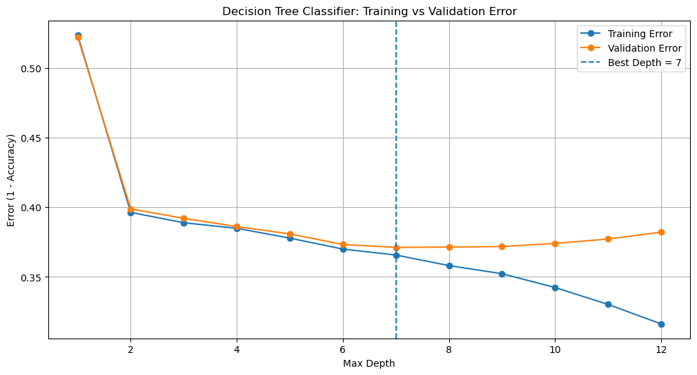

The gini classifier reaches its best validation point at depth 7, with a similar training-versus-validation pattern and mild overfitting at deeper levels.

##### Feature Importance

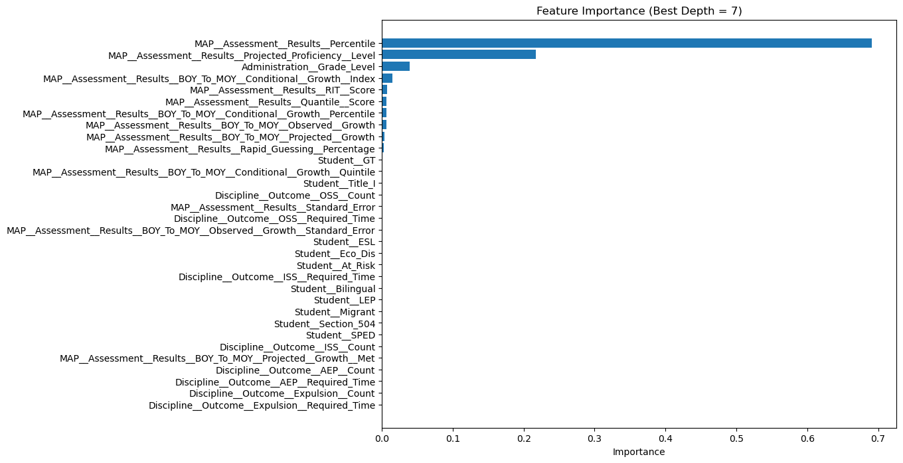

Its feature-importance profile is also assessment-centric, though the top-ranked feature ordering shifts slightly relative to entropy.

### Entropy vs Gini Comparison

| Classifier Criterion | Best Depth | Best Validation Error |
|----------------------|-----------:|----------------------:|
| Entropy | 8 | 0.3676 |
| Gini | 7 | 0.3712 |

Entropy performs slightly better than gini on validation error (lower is better), with a margin of 0.0036. The difference is modest, suggesting both criteria are viable, but entropy has a small edge in this Phase I evaluation.

### Summary

Decision-tree results reinforce the EDA and linear-model findings: MAP assessment features drive most predictive power, while added context features provide secondary refinement. The regressor depth search identifies a stable optimum at depth 9, and entropy is the stronger classifier criterion in this run.

---

## Random Forest

Phase I also evaluated Random Forest models for both regression and classification, using grid-search tuning and cross-validation to identify stable high-performing configurations.

### Regressor Model

Best Parameters: `{'max_depth': 10, 'min_samples_leaf': 5, 'n_estimators': 200}`

Best CV R2 Score: `0.7553144791633393`

Train R2: 0.7764  
Test R2: 0.7515  
MAE: 3.6188  
MSE: 22.0514

The regressor results are strong and consistent. Cross-validation and holdout performance are closely aligned, and the train-to-test R2 gap is small (0.0249), which suggests controlled overfitting. Compared with earlier linear baselines, the Random Forest regressor captures additional nonlinear signal and reduces absolute and squared prediction error.

### Classifier Models

#### Entropy Classifier

Best Parameters: `{'max_depth': 10, 'max_features': None, 'n_estimators': 200}`

Best CV F1: `0.6372485897250011`

Train F1 Score: 0.6688  
Test F1 Score: 0.6379  
Train ROC AUC OVR Weighted: 0.8896  
Test ROC AUC OVR Weighted: 0.8656

##### ROC Curve

The entropy ROC curves show strong class separation for the highest and lowest performance bands, with the most overlap in middle bands.

##### Confusion Matrix

The confusion matrix is diagonal-dominant, but the largest errors occur between adjacent categories (`Did Not Meet` vs `Approaches`, and `Approaches` vs `Meets`), which is expected for ordered proficiency outcomes.

#### Gini Classifier

Best Parameters: `{'max_depth': 10, 'max_features': None, 'n_estimators': 100}`

Best CV F1: `0.6375613671281835`

Train F1 Score: 0.6751  
Test F1 Score: 0.6387  
Train ROC AUC OVR Weighted: 0.8895  
Test ROC AUC OVR Weighted: 0.8654

##### ROC Curve

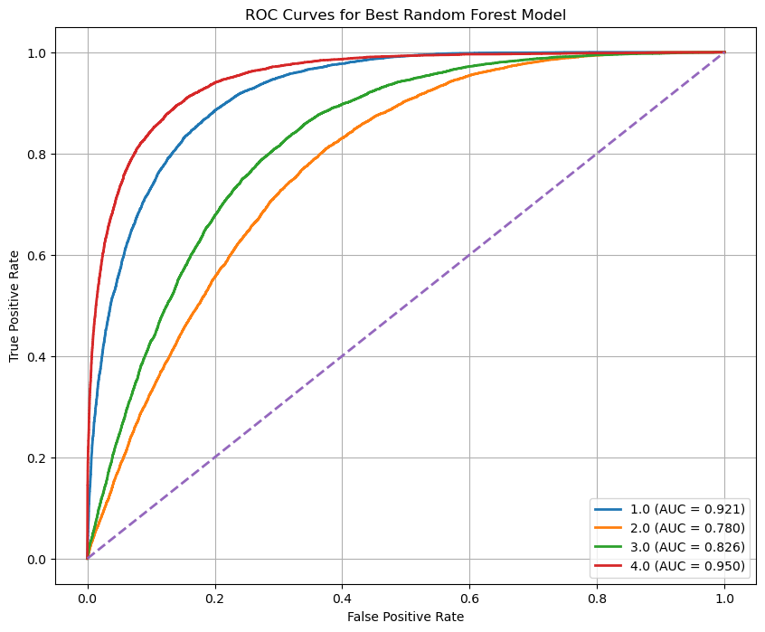

The gini model produces nearly identical ROC behavior to entropy.

##### Confusion Matrix

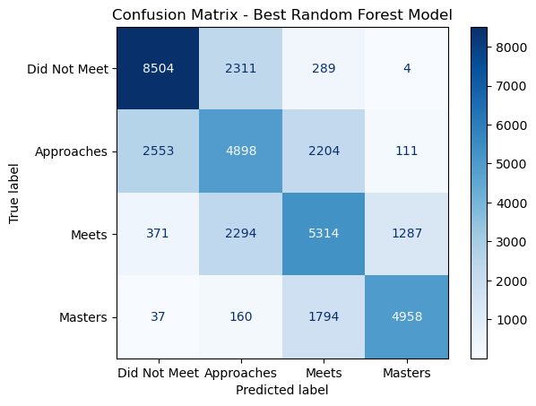

The confusion matrix is similarly diagonal-dominant. As with entropy, misclassification is concentrated around neighboring performance levels rather than extreme label jumps.

### Entropy vs Gini Comparison

| Classifier Criterion | Best Params (Key Difference) | Best CV F1 | Train F1 | Test F1 | Train ROC AUC OVR Wtd | Test ROC AUC OVR Wtd |
|----------------------|-------------------------------|-----------:|---------:|--------:|----------------------:|---------------------:|
| Entropy | `n_estimators=200` | 0.6372 | 0.6688 | 0.6379 | 0.8896 | 0.8656 |
| Gini | `n_estimators=100` | 0.6376 | 0.6751 | 0.6387 | 0.8895 | 0.8654 |

Gini has a slight edge on F1 (CV, train, and test), while entropy has a slight edge on ROC AUC (train and test). The differences are very small, so both criteria are effectively comparable in predictive quality for this Phase I dataset.

### Summary

Random Forest delivers the strongest Phase I regression performance so far and highly competitive multiclass classification behavior. The classifier results are stable across entropy and gini, with differences small enough that final criterion selection can be based on operational preference, interpretability, or downstream governance standards.

---

## XGBoost

Phase I also evaluated XGBoost for both regression and classification tasks, using GridSearchCV-based tuning for the final regressor and classifier models.

### Regressor Model

Best Parameters: `{'learning_rate': 0.1, 'max_depth': 5, 'n_estimators': 200}`

Best CV R2 Score: `0.7605478549558835`

Train R2: 0.7751  
Test R2: 0.7567  
MAE: 3.5748  
RMSE: 4.6471

#### Regressor Feature Importance

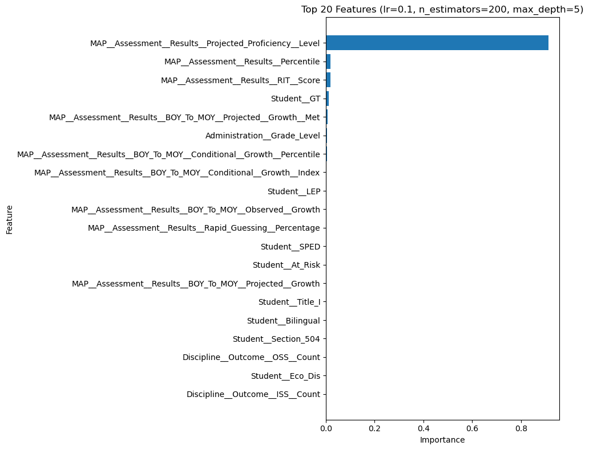

The GridSearchCV regressor shows a small train-to-test gap in R2, indicating stable generalization. Its feature-importance profile is assessment-centric, led by projected proficiency level with modest contributions from percentile and RIT score.

### Classifier Model

Best Parameters: `{'learning_rate': 0.05, 'max_depth': 5, 'n_estimators': 200}`

Best CV Weighted F1: `0.6418084071756709`

#### ROC Curve

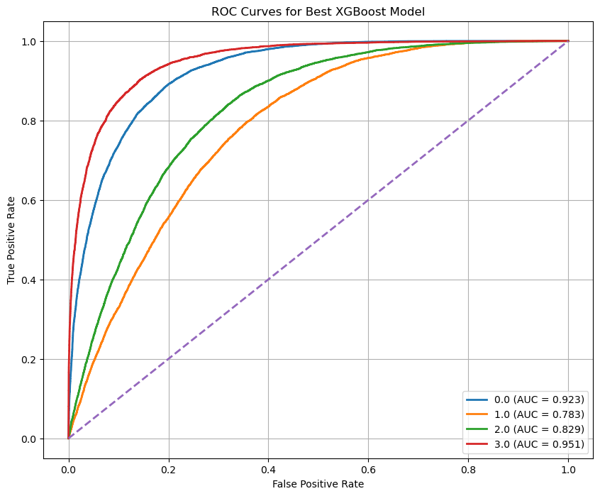

The ROC plot shows strong one-vs-rest discrimination for `Masters` (AUC about 0.951) and `Did Not Meet` (AUC about 0.923), with lower but still useful separability for `Meets` (about 0.829) and `Approaches` (about 0.783).

#### Confusion Matrix

The confusion matrix is diagonal-dominant, and most mistakes occur between adjacent achievement bands rather than between extreme categories, which is consistent with ordinal proficiency structure.

### Summary

XGBoost delivers high and stable regression performance, comparable to the best Random Forest results, while maintaining strong multiclass classification quality. Across the tuned regressor and classifier outputs, the dominant signal remains concentrated in core MAP assessment features, especially projected proficiency level.

---

## Support Vector Machine (SVM)

Phase I also evaluated SVM pipelines for both regression and classification using standardized features and GridSearchCV-tuned RBF models.

### SVR Model

Best Parameters: `{'svr__C': 10, 'svr__epsilon': 0.5, 'svr__gamma': 'auto', 'svr__kernel': 'rbf'}`

Train R2: 0.7698  
Test R2: 0.7470  
MAE: 3.6194  
RMSE: 4.7387

#### Actual vs Predicted

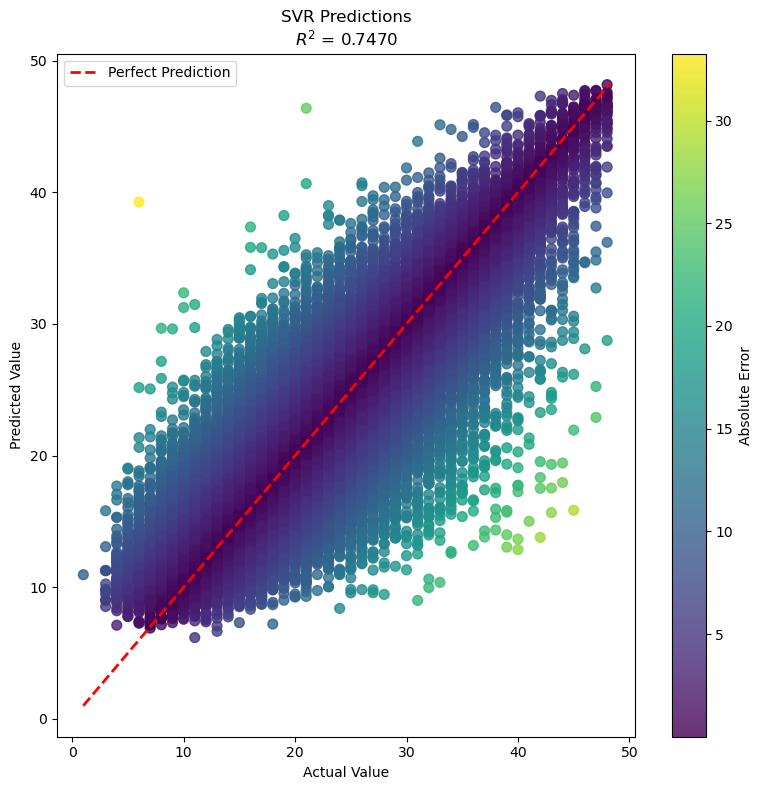

The actual-vs-predicted view follows the diagonal trend with moderate spread, consistent with solid but not perfect fit.

#### Residual Plot

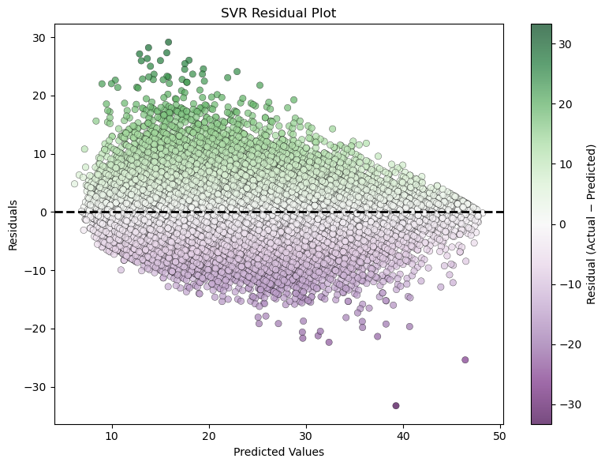

The residual plot is centered around zero but shows a widening error envelope through the mid-range and tighter spread at the upper end, indicating some heteroscedastic behavior across score bands.

#### Prediction Error Distribution

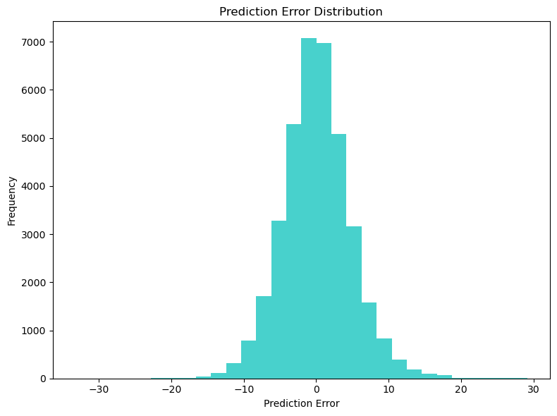

The error distribution is approximately bell-shaped around zero with mild tails, which aligns with the reported MAE/RMSE values.

### SVC Model

Best Parameters: `{'svc__C': 10, 'svc__class_weight': 'balanced', 'svc__gamma': 'scale', 'svc__kernel': 'rbf'}`

Best CV Weighted F1: `0.6217821837228118`

#### ROC Curve

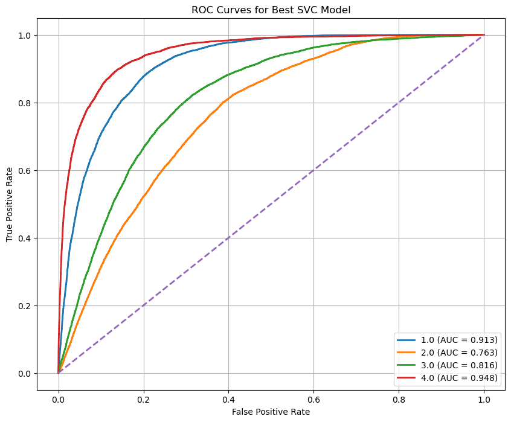

The ROC curves show strongest separation for class 4 (`Masters`, AUC about 0.948) and class 1 (`Did Not Meet`, AUC about 0.913), with lower separation in the middle bands (class 2 about 0.763, class 3 about 0.816).

#### Confusion Matrix

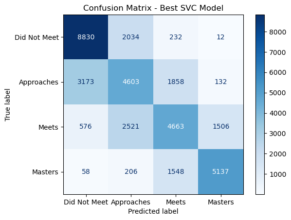

The confusion matrix is diagonal-dominant, but most misclassification occurs between adjacent achievement categories, especially around `Approaches` and `Meets`, which is expected in ordinal proficiency tasks.

### Summary

SVM provides competitive, stable performance with interpretable diagnostic behavior across both tasks. SVR maintains strong regression fit with controlled generalization gap, while SVC shows reliable class discrimination at the extremes and expected overlap in middle proficiency levels.

---

## Cross-Model Comparison and Selection

This section compares model families across the shared feature set and identifies the strongest candidate for each prediction track.

### Regressor Comparison

| Model Family | Primary Reported Metric(s) | Result |
|--------------|-----------------------------|-------:|
| Linear Models (best: Model 3) | Test R2, RMSE | R2 = 0.6907, RMSE = 5.2705 |
| Decision Tree Regressor | Best validation error (depth search) | 0.2629 (depth = 9) |
| Random Forest Regressor | Test R2, MAE, MSE | R2 = 0.7515, MAE = 3.6188, MSE = 22.0514 |
| XGBoost Regressor | Test R2, MAE, RMSE | R2 = 0.7567, MAE = 3.5748, RMSE = 4.6471 |
| SVM (SVR) | Test R2, MAE, RMSE | R2 = 0.7470, MAE = 3.6194, RMSE = 4.7387 |

Decision Tree regression uses a different validation-error scale, so it is directionally informative but not directly comparable to the holdout R2/RMSE values reported for the other model families.

### Best Regressor Model

Based on comparable holdout metrics, XGBoost is the strongest regressor candidate in Phase I. It has the highest reported test R2 (0.7567) and the lowest MAE among the tuned non-linear regressors, with RMSE also near the best observed range.

### Classifier Comparison

| Model Family | Primary Reported Metric(s) | Result |
|--------------|-----------------------------|-------:|
| Decision Tree Classifier (Entropy) | Best validation error | 0.3676 (depth = 8) |
| Decision Tree Classifier (Gini) | Best validation error | 0.3712 (depth = 7) |
| Random Forest Classifier (best: Gini) | Test weighted F1, test ROC AUC OVR weighted | F1 = 0.6387, ROC AUC = 0.8654 |
| XGBoost Classifier | Best CV weighted F1 | 0.6418084071756709 |
| SVM (SVC) | Best CV weighted F1 | 0.6217821837228118 |

Decision Tree classifier results are reported as validation error, while the other families are reported with weighted F1 and ROC/AUC. Those scales are not equivalent, so direct numeric ranking should prioritize like-for-like metrics.

### Best Classifier Model

Using weighted F1 as the primary comparable criterion, XGBoost is the best classifier candidate in Phase I (best CV weighted F1 = 0.6418), with Random Forest as a close second and strong accompanying ROC/AUC evidence.

### Final Recommendation

- Best regressor: XGBoost Regressor
- Best classifier: XGBoost Classifier

These selections provide the strongest overall predictive performance under the current Phase I evaluation setup and should be used as primary baselines for Phase II benchmarking and governance review.

---

## Next Steps for Model Improvement

### Integrate TES Summative Results

Add TES Summative Results as teacher-linked predictors by joining each student record to the assigned subject teacher for Grade 3-8 Math. This should add instructional-effect signal that is not currently represented in the model and may improve both raw-score prediction and performance-level classification.

Key implementation points:

- Build a stable student-to-teacher assignment key at the test-window level.
- Include teacher-level TES features (for example: summative rating band and domain subscores).
- Validate join coverage and missingness to prevent silent bias from unmatched records.

### Favor Underprediction in Classification

Because classification use cases may prefer conservative outcomes, apply methods that penalize overprediction more than underprediction.

Recommended techniques:

- Use asymmetric misclassification costs with a higher penalty when predicted performance level is above the actual level.
- Tune one-vs-rest probability thresholds to shift borderline predictions downward.
- Use class-weight and sample-weight strategies that reduce false positives for higher performance bands.
- Evaluate ordinal-aware approaches (for example, ordinal loss or post-processing rules) that preserve adjacent-band behavior while favoring underprediction.

### Additional Improvements from Phase I Findings

- Handle class imbalance with stratified validation and better class weighting.
- Improve discipline features with simple sparsity handling (zero flags and capped values).
- Calibrate classifier probabilities and decision thresholds before final use.
- Use stronger validation splits (grouped or time-aware) to reduce leakage risk.
- Improve regression stability for uneven error patterns seen in SVR residuals.
- Compare all models with one consistent evaluation setup (same folds, holdout, and metrics).

### Phase II Execution Priority

1. Integrate and quality-check TES teacher-linked features.
2. Retrain XGBoost and Random Forest baselines with the updated feature space.
3. Apply underprediction-oriented classification tuning and compare against current weighted F1/ROC baselines.
4. Re-run full model comparison and confirm whether best-model selections remain stable.

---

